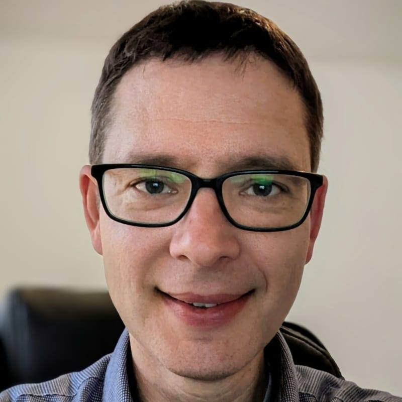
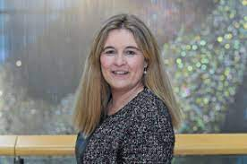
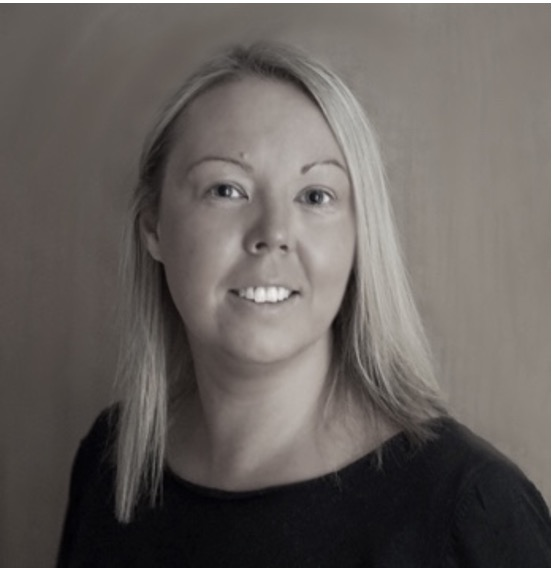
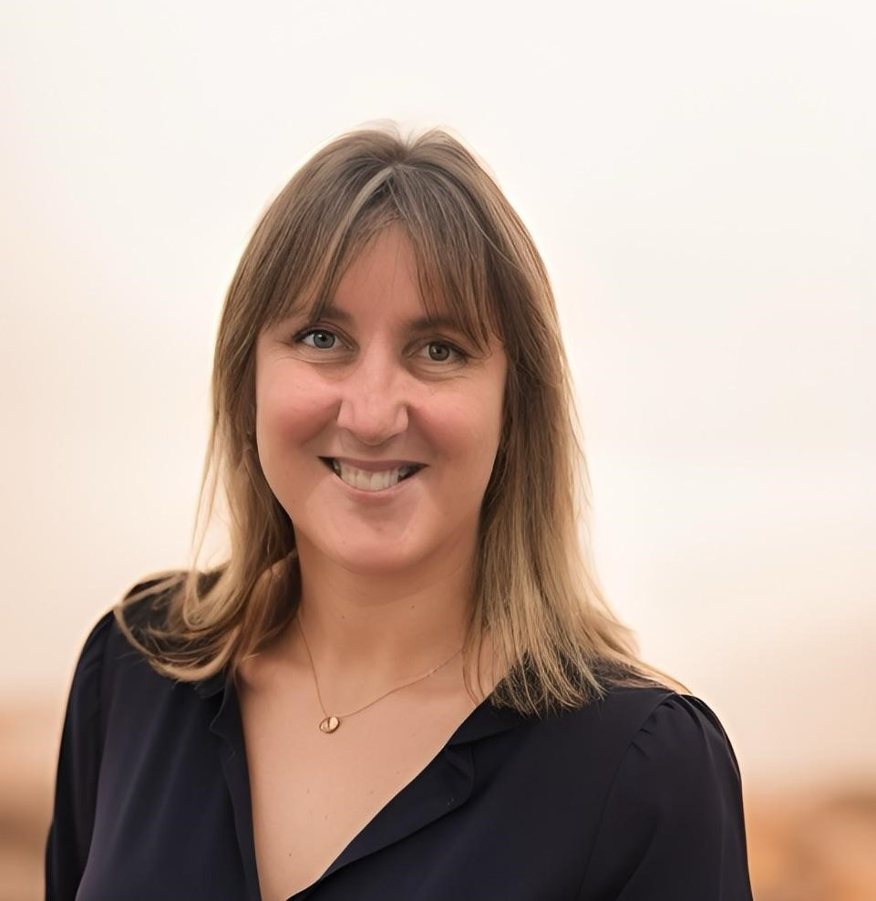
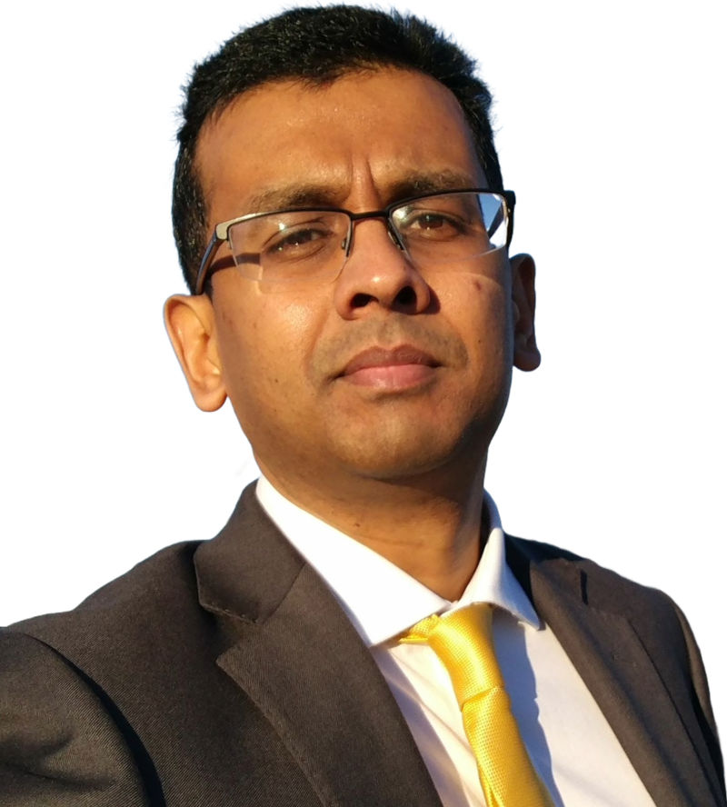
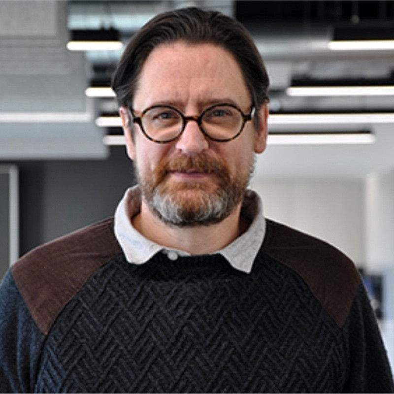
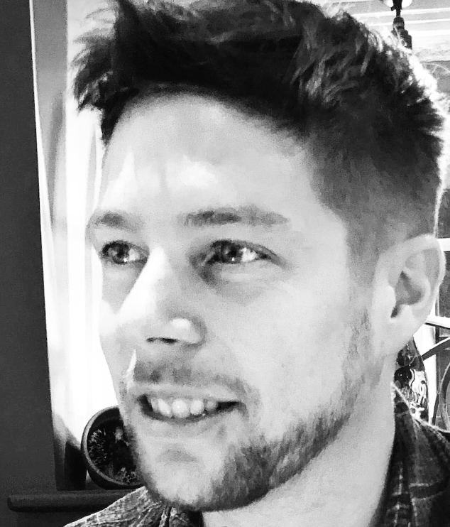
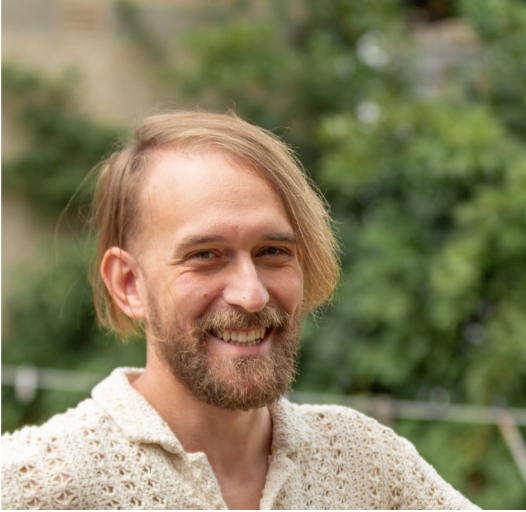

# The Team

## Philip Couch

{ align=left width=200}

Philip Couch is a Research Technical Professional (RTP) based in the Centre for Health Informatics at the University of Manchester.
They have a background in the physical sciences and have a PhD in Chemistry (Molecular Astrophysics).
Philip has a range of experience in the development of standards, software and infrastructure for data science activities.
They currently lead a team of RTPs as an Information Systems Programme Manager across research projects and teaching programmes.
This has included leading the development of the data analysis environments for the Greater Manchester Secure Data Environment.
Philip has experience developing and maintaining teams across IT related activities, and they are working to find ways to better support technical professionals that work in research environments.
They are the Principal Investigator for the SDE Team Development Hub.

## Georgina Moulton

{ align=right width=200}

Georgina Moulton is a Professor of BioHealth Informatics and Education, and is a leading academic in the development of digital health education and training.
With 20 years’ experience she has led the development of four national frameworks focusing on the development of digital skills for health.
All are in use today.
Throughout her career she has worked with communities and employers to ensure that the training and education that she leads is addressing their needs.
She has advocated for the importance of the recognition of technical professionals.
She is the Deputy Director of the Division for Informatics, Imaging and Data Sciences, and most recently she has been appointed the Associate Dean of Teaching Excellence and Student Outcomes for the Faculty of Biology, Medicine and Health Sciences at The University of Manchester.

## Charlie Stockton-Powdrell

{ align=left width=200}

Charlie Stockton-Powdrell is an Information Systems Programme Manager and Co-Leads the Digital Health Software Team in the Centre for Health Informatics at the University of Manchester.
With over 10 years’ of experience in digital health research, her role involves overseeing the delivery of a number of digital health projects.
She also has experience of developing competency frameworks for research project managers working in academic health research.
Charlie has worked in interdisciplinary research teams for almost 20 years and she Co-Leads the Team Research Programme with Ruth Norris.
The Team Research Programme aims to enhance research by providing training for staff to develop their collaborative and interdisciplinary working.

## Ruth Norris

{ align=right width=200}

Ruth Norris has a 20+ year track record delivering change in both commercial settings and academia.
She has delivered a range of UK research programmes funded by the MRC, NIHR, EPSRC and UK government and was founding Operational Director of the Christabel Pankhurst Institute for Health Technology Research and Innovation.
Ruth provides senior operational leadership and support for inter-disciplinary teams to deliver research, and facilitates collaboration to magnify impact across the UK and internationally.
Ruth is also co-lead for the Teams Build Dreams Team Research programme.

## Vishnu V Chandrabalan

{ align=left width=200}

Vishnu Chandrabalan is a Consultant Surgeon and the Chief Clinical Information Officer of the Lancashire and South Cumbria SDE where he leads a large inter-disciplinary team responsible for building and operating a region-scale cloud analytics platform.
He also oversees the development of their Kubernetes-native Trusted Research Environment and the regional OMOP data engineering efforts.
The latter has won his team a HDRUK national award and a nomination for the global OHDSI Titan award.
He collaborates with a wide network of academic and commercial partners on digital research infrastructure and real world evidence programs.
He is a Honorary Professor at Lancaster University.

## Gary Leeming

{ align=right width=200}

Gary Leeming is the Technical Director of the Civic Health Innovation Labs and the Mental Health Research for Innovation Centre, based at the University of Liverpool.
He oversees work on developing technology and infrastructure for learning health systems and secure research across academic, civic and health data.
Previously he was the Chief Technology Officer at the Connected Health Cities programme, and the Director of Informatics at the Manchester Academic Health Science Network working on digital innovation and health information exchanges, and systems for use of real world data in clinical trials on the Salford Lung Study and other projects.

## Michael Harding

{ align=left width=200}

Mike Harding is a Research Fellow in the School of Computing & Communications at Lancaster University who is currently on secondment at Lancashire Teaching Hospital as a Research Software Engineer on the Lancashire and South Cumbria Secure Data Environment (LSCSDE) Programme.
His research interests include the co-design of pervasive and decision-support infrastructure to enable data-driven transformation in cooperative work environments – primarily across transport and healthcare settings.
As part of the LSCSDE, his work is exploring the role of modern cloud computing technologies to support next-generation secure data environments that are cloud-agnostic, scalable and sustainable within a rapidly evolving digital health landscape.

## Ed Tempest

{ align=right width=200}

Edd Tempest is a Senior Infrastructure Engineer at the University of Manchester’s Centre for Health Informatics, where he spearheads the development of secure research infrastructure and platforms within the Data Science Platforms team.
With a rich background in software engineering, Edd brings a strong foundation in developing software applications, which remains his preferred area of expertise.
Drawing from his experience as a software engineer, Edd is committed to advancing the field of health informatics through the creation of robust, secure, and innovative research platforms that support cutting-edge research and improve healthcare outcomes.
