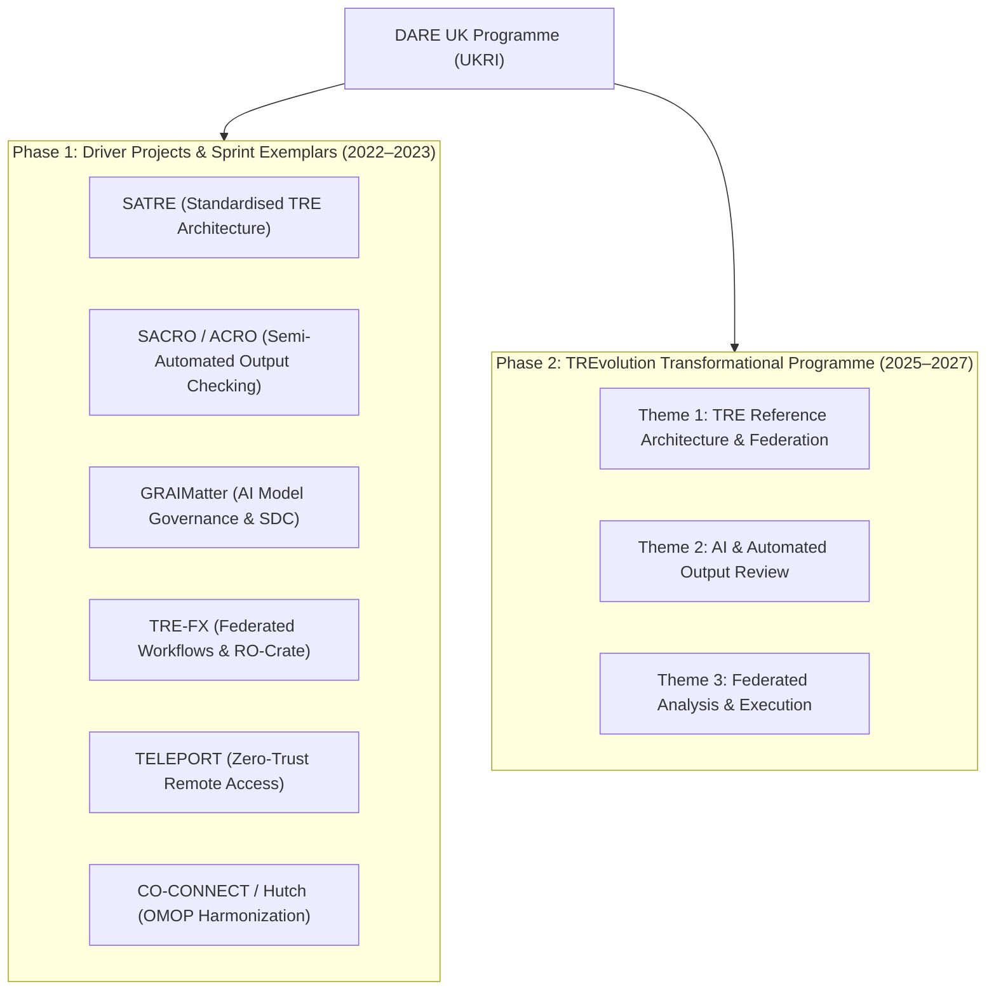

# DARE UK Funded TRE & SDE Projects: Technology Stack Matrix

> [!IMPORTANT]
> **Provenance & Objective**: This document provides an exhaustive technology mapping of tools, frameworks, specifications, and protocols funded and developed under the **UKRI DARE UK (Data and Analytics Research Environments UK)** programme.
> 
> It covers Phase 1 Sprint Exemplars, Driver Projects, and the Phase 2 **TREvolution** Transformational Programme, linking every technology to its official project page, open-source GitHub repository, and technical specification.

---

## 🏛️ DARE UK Project Portfolio Overview

---

## 1. Project-by-Project Technology Deep Dive

### 1.1 SATRE (Standardised Architecture for Trusted Research Environments)
* **Lead Institutions**: Alan Turing Institute, University of Dundee (HIC), UCL, Research Data Scotland
* **Official Pages & Repos**:
  * [DARE UK SATRE Project Page](https://dareuk.org.uk/driver-project-satre/)
  * [SATRE Specification v1.0 / v2.0 Docs](https://satre-specification.readthedocs.io/)
  * [SATRE GitHub Organisation](https://github.com/sa-tre)
* **Core Technical Stack**:
  * **IaC & Automation**: `Terraform`, `OpenTofu`, `Azure TRE`, `AWS Service Workbench`
  * **Identity & Authentication**: `Keycloak`, `OAuth 2.0 / OIDC`, `SAML 2.0`, `FIDO2 / WebAuthn`
  * **Remote Desktop & Access**: `Apache Guacamole`, `Zero Trust Network Access (ZTNA)`
  * **Secret Management & Hardening**: `HashiCorp Vault`, `Azure Key Vault`, `CIS Benchmarks`
  * **Audit & Storage**: `Syslog (RFC 5424)`, `SHA-256 Checksums`, `Ceph / Object Storage`
* **Mapped Subdomains**: `infrastructure-and-deployment`, `identity-management`, `access-control`, `secure-user-experience`, `system-architecture`, `audit-and-compliance-monitoring`

---

### 1.2 SACRO & ACRO (Semi-Automated Checking of Research Outputs)
* **Lead Institutions**: University of the West of England (UWE Bristol), University of Essex (UK Data Service), University of Aberdeen
* **Official Pages & Repos**:
  * [DARE UK SACRO Project Page](https://dareuk.org.uk/driver-project-sacro/)
  * [AI-SDC ACRO GitHub Repository](https://github.com/AI-SDC/ACRO)
  * [ACRO PyPI Package](https://pypi.org/project/acro/) / [ACRO CRAN Package](https://cran.r-project.org/package=acro)
* **Core Technical Stack**:
  * **SDC Automation Engines**: `ACRO (Automated Checking of Research Outputs)`, `sdcMicro`
  * **Languages & Environments**: `Python (acro)`, `R (acro)`, `JupyterLab`, `RStudio`
  * **Output Governance Protocols**: `Rule-of-10 Threshold Checks`, `Dominance Rules (k%)`, `Cell Suppression`, `Automated JSON Disclosure Logs`
  * **Airlock Integration**: Direct API connectors to `Data Airlock` quarantine queues
* **Mapped Subdomains**: `statistical-disclosure-control`, `output-checking`, `tools-and-platforms-to-support-output-checking`, `software-engineering`

---

### 1.3 GRAIMatter (Guidelines & Resources for AI Model Access in TREs)
* **Lead Institutions**: University of Dundee (Health Informatics Centre), University of Glasgow, Alan Turing Institute
* **Official Pages & Repos**:
  * [DARE UK GRAIMatter Project Page](https://dareuk.org.uk/sprint-exemplar-project-graimatter/)
  * [GRAIMatter Recommendations (Zenodo)](https://zenodo.org/records/6548549)
  * [AI-SDC GitHub Tooling](https://github.com/AI-SDC)
* **Core Technical Stack**:
  * **Privacy-Preserving AI & PETs**: `Differential Privacy (DP-SGD)`, `TensorFlow Privacy (TF-Privacy)`, `PySyft`
  * **Model Risk Auditing Tools**: `Privacy-Meter` (Membership Inference Attack auditor), `CleverHans`
  * **Explainability & Attribution**: `SHAP (SHapley Additive exPlanations)`, `LIME`
  * **Deep Learning Frameworks**: `PyTorch`, `TensorFlow`, `Scikit-Learn`
  * **Model Governance Standard**: `AI Model Disclosure Checklists`, `AI Bill of Materials (AIBOM)`
* **Mapped Subdomains**: `statistical-disclosure-control`, `output-checking`, `tools-and-platforms-to-support-output-checking`, `software-engineering`

---

### 1.4 TRE-FX (Delivering a Federated Network of TREs)
* **Lead Institutions**: University of Birmingham, University of Nottingham, Swansea University, University of Manchester
* **Official Pages & Repos**:
  * [DARE UK TRE-FX Project Page](https://dareuk.org.uk/driver-project-tre-fx/)
  * [TRE-FX GitHub Organisation](https://github.com/trefx)
  * [Five Safes RO-Crate Specification](https://trefx.uk/five-safes-ro-crate/)
* **Core Technical Stack**:
  * **Metadata & Provenance Standards**: `Five Safes RO-Crate`, `JSON-LD`, `FAIR Data & Software Standards`
  * **Workflow Execution APIs**: `GA4GH TES (Task Execution Service)`, `GA4GH WES (Workflow Execution Service)`
  * **Workflow Engines**: `WfExS-backend (Workflow Execution Service Backend)`, `Nextflow`, `Snakemake`
  * **Secure Container Packaging**: `Singularity / Apptainer`, `Docker`, `OCI Images`
* **Mapped Subdomains**: `system-architecture`, `software-engineering`, `infrastructure-and-deployment`, `data-governance`

---

### 1.5 TELEPORT (Connecting TREs Safely)
* **Lead Institutions**: Swansea University (SAIL Databank), University of Manchester
* **Official Pages & Repos**:
  * [DARE UK TELEPORT Project Page](https://dareuk.org.uk/driver-project-teleport/)
  * [TELEPORT Architecture Summary](https://dareuk.org.uk/)
* **Core Technical Stack**:
  * **Zero-Trust Access Proxies**: `Gravitational Teleport`, `HashiCorp Boundary`
  * **Identity & Authentication**: `OpenSSH Certificate Authorities`, `Short-Lived TLS Certificates`, `MFA / WebAuthn`
  * **Network Hardening**: `Clientless Encrypted Transport`, `Air-Gapped Reverse Tunnels`
  * **Auditability**: `Session Recording`, `Tamper-Evident Keystroke Logging`
* **Mapped Subdomains**: `access-control`, `secure-user-experience`, `infrastructure-and-deployment`, `audit-and-compliance-monitoring`

---

### 1.6 CO-CONNECT & Hutch (Health Data Harmonization Client)
* **Lead Institutions**: University of Nottingham, University of Dundee, Health Data Research UK (HDR UK)
* **Official Pages & Repos**:
  * [CO-CONNECT Project Page](https://co-connect.ac.uk/)
  * [HDR UK Hutch GitHub Client](https://github.com/HDRUK/hutch)
* **Core Technical Stack**:
  * **Clinical Harmonization Engine**: `Hutch Agent` (Python / Docker container deployed behind local NHS Trust firewalls)
  * **Health Data Standard**: `OMOP Common Data Model (v5.4)`, `SNOMED-CT`, `ICD-10`
  * **Integration Protocols**: `REST APIs`, `PostgreSQL / MS SQL connectors`, `Docker Compose`
* **Mapped Subdomains**: `data-engineering-and-processing`, `data-governance`, `software-engineering`

---

### 1.7 Bitfount / Federated Machine Learning Driver
* **Lead Institutions**: University of Cambridge, Bitfount
* **Official Pages & Repos**:
  * [DARE UK Bitfount Project Page](https://dareuk.org.uk/)
  * [Bitfount Platform](https://www.bitfount.com/)
* **Core Technical Stack**:
  * **Federated Analytics**: `Bitfount Hub & Pods`, `Federated Learning (FL)`, `PyTorch`
  * **Privacy Guarantees**: `Differential Privacy Algorithms`, `Secure Aggregation Protocols`
  * **Isolation**: `Pod-based local data processing (no raw data egress)`
* **Mapped Subdomains**: `statistical-disclosure-control`, `system-architecture`, `access-control`

---

### 1.8 TREvolution (2025–2027 Phase 2 Transformational Programme)
* **Funding & Scope**: £4.94m UKRI Investment (March 2025 – March 2027)
* **Official Pages**:
  * [DARE UK TREvolution Announcement](https://dareuk.org.uk/ukri-invests-4-94m-in-trevolution/)
  * [eScience Lab TREvolution Collaboration](https://esciencelab.org.uk/projects/trevolution/)
* **Strategic Technical Pillars**:
  1. **TRE Reference Architecture & Federation**: `SATRE v2.0`, `Federation Pillar`, `OpenAPI Machine-Readable Contracts`
  2. **AI & Semi-Automated Output Checking**: Scaling `ACRO` & `GRAIMatter` to all UK regional SDE nodes
  3. **Federated Analysis & Execution**: Production integration of `Five Safes RO-Crate` with `GA4GH TES/WES` & `Nextflow`
* **Mapped Subdomains**: `system-architecture`, `statistical-disclosure-control`, `output-checking`, `tools-and-platforms-to-support-output-checking`, `regulatory-compliance`

---

## 📊 Consolidated DARE UK Technology Stack Matrix

| Tool, Technology, or Standard | Category | Originating DARE UK Project | Proposed Source Tag | Primary Mapped Subdomain |
| :--- | :--- | :--- | :--- | :--- |
| **SATRE Specification (v1.0 / v2.0)** | Standard | SATRE Driver Project / TREvolution | `dare-uk` | `regulatory-compliance` / `system-architecture` |
| **ACRO (Python / R)** | Tool | SACRO Driver Project | `dare-uk` | `statistical-disclosure-control` / `output-checking` |
| **Five Safes RO-Crate** | Standard | TRE-FX Driver Project | `dare-uk` | `data-governance` / `system-architecture` |
| **GA4GH TES & WES APIs** | Standard | TRE-FX Driver Project / TREvolution | `dare-uk` | `software-engineering` / `system-architecture` |
| **WfExS-backend** | Tool | TRE-FX Driver Project | `dare-uk` | `system-architecture` / `infrastructure-and-deployment` |
| **GRAIMatter AI Disclosure Guidelines** | Standard | GRAIMatter Sprint Exemplar | `dare-uk` | `statistical-disclosure-control` / `output-checking` |
| **Differential Privacy ($\epsilon, \delta$)** | Standard | GRAIMatter / Bitfount / SACRO | `dare-uk` | `statistical-disclosure-control` |
| **Hutch (Data Harmonization Client)** | Tool | CO-CONNECT / HDR UK | `dare-uk` | `data-engineering-and-processing` |
| **Teleport Zero-Trust Proxy** | Tool | TELEPORT Driver Project | `dare-uk` | `access-control` / `secure-user-experience` |
| **OpenSSH Certificate Authentication** | Standard | TELEPORT Driver Project | `dare-uk` | `access-control` / `identity-management` |
| **Bitfount Federated Learning** | Tool | Bitfount Driver Project | `dare-uk` | `statistical-disclosure-control` / `system-architecture` |
| **Apache Guacamole (Remote Desktop)** | Tool | SATRE Reference Implementations | `dare-uk` | `secure-user-experience` |
| **Azure TRE / AWS Workbench IaC** | Tool | SATRE Implementation Blueprint | `dare-uk` | `infrastructure-and-deployment` |
| **Nextflow / Snakemake Workflows** | Tool | TRE-FX / TREvolution Theme 3 | `dare-uk` | `system-architecture` / `software-engineering` |
| **Singularity / Apptainer Containers** | Tool | TRE-FX / SATRE Pillars | `dare-uk` | `infrastructure-and-deployment` / `software-engineering` |
